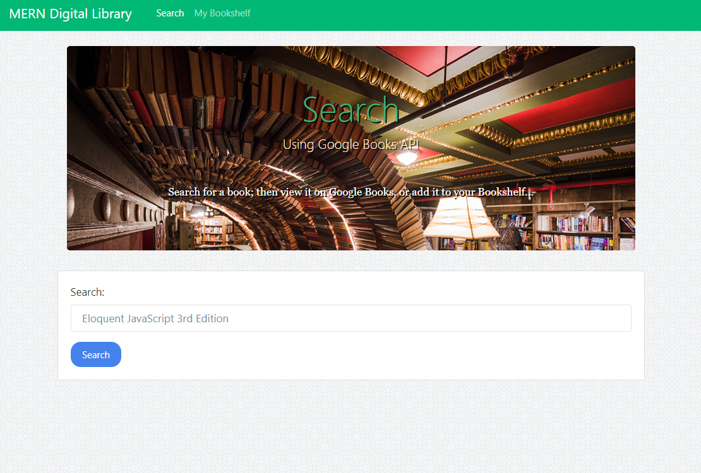

# MERN-Library
##### Book Search Application using MongoDB, Express, React, &amp; Node

MERN-Library is a React-based Google Books Search application.  It allows you to search the Google Books API for books that you might like to read; displaying for you the book information including an image of the book, title, authors, description, published date, and number of pages.  Furthermore you are then able to save the book to your 'Bookshelf' to reference later.  You are also provided with a link to the book on Google's site.  The server for the application is supported by Node.js and Express and a MongoDB database is used to store your 'Bookshelf' which is queried via Mongoose.




## Getting Started

These instructions will get you a copy of the project up and running on your local machine for development and testing purposes.  See deployment for notes on how to deploy the project on a live system.

### Prerequisites

In order to install and run MERN-Library on your own device you will need to be able to run MongoDB, in addition to needing the following npm packages:

```
Node.js
Express.js
Mongoose
Axios
```

### Installing

You will need to do the following steps after cloning the repo to your device in order to ensure that it works properly.

To ensure Node.js is running within the package and configure all modules for use:

```
npm install
```

This should install all the requisite modules for the server and then cd into the client folder to install all the modules required there.  following this installation check to make sure that you have a node_modules folder in both the root directory and within the 'client' folder and things should be ready to run.

```
For the Server:
express             (npm i -s express)
axios               (npm i -s axios)
if-env              (npm i -s if-env)
mongoose            (npm i -s mongoose)
concurrently        (npm i -s concurrently)

For the React App:
axios               (npm i -s axios)
react               (npm i -s react)
react-dom           (npm i -s react-dom)
react-router-dom    (npm i -s react-router-dom)
react-scripts       (npm i -s react-scripts)
alert               (npm i -s react-alert)
```

## Running 'MERN-Library'

To run MERN-Library locally you will need to have MongoDB running on your computer, you can then begin the server simply by path into the root folder for the application and running:

```
npm start
```

As per the package.json... with it being in dev mode (which is checks for), it will run ```nodemon --ignore 'client/*'``` (Starting the server and ignoring the contents of the client folder, which houses the React Application) concurrently with running ```npm run client``` = ```cd client && npm run start```which grabs the client folder and starts the React Application running on proxy port 3001. If all runs smoothly you should see another browser tab open and navigate to the site.

## Deployment

* [Deployed Site]()

I personally have this application deployed using Heroku, with mLab serving serving as the remote MongoDB database.  The steps to deploy in this manner are as follows:

Initialize your own copy of the project as a Git Repo if you have not already done so using:
```
git init
```

Create a heroku app on the heroku website, this is where you will be pushing the project to for deployment.  Then add the mLab Addon for the MongoDB Database.

Add and commit your changes on your own device before pushing to Heroku (the first command will be provided for you by Heroku):
```
heroku git:remote -v <name of your heroku application>
```
Then:
```
git push heroku master
```
Heroku automatically sets the NODE_ENV to Production and will thus run the build commands within the package.json.  Additionally, in order to be able to utilize the Google Books API, you will have to provide your Heroku Application with your API key for the site.  This can be done in your application settings on Heroku.


## Built With

* [React](https://reactjs.org/) - JavaScript Library
* [Node.js](https://nodejs.org/en/) - Runtime Environment
* [Express.js](https://expressjs.com/) - Web Framework
* [Mongoose](https://mongoosejs.com/) - MongoDB Object Modeling
* [MongoDB](https://www.mongodb.com/) - Database
* [Bootstrap](https://getbootstrap.com/) - CSS Framework
* [gitignore.io](https://www.gitignore.io/) - For creating the .gitignore
* [WebStorm](https://www.jetbrains.com/webstorm/) - JavaScript IDE

## Authors

* **Dalton Ricker** - *Primary Author* - [SasquatchXYZ](https://github.com/SasquatchXYZ)

## Acknowledgments
* Many thanks to my instructors & TAs, as well as the O'Reilly reference books.
